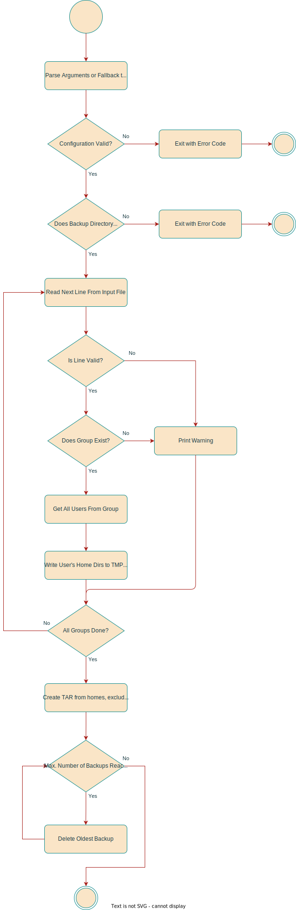

# Projekt Dokumentation

Erstellt am 20.05.2022.

## Lösungsdesign

Anhand der Analyse wurde folgendes Lösungsdesign entworfen.

### Syntax

Kommandozeilen-Beispiele sehen so aus:

```sh
# root-befehl <argumente>
$ non-root-befehl <argumente>
```

Kommandos die `root`-Berechtigungen benötigen werden mit einem `#` geschrieben.
Kommandos ohne spezielle Berechtigungen mit `$`.

Dies (`# ` oder `$ `) ist rein visuell fürs Verständnis und gehört nicht zum
eigentlichen Befehl hinzu.

### Aufruf der Skripte

Es wird in folgender Reihenfolge (Priorität) nach Konfigurationsdateien
gesucht.

- Kommandozeilenargument (wird mittels --config übergeben)
- $PWD
- $XDG_CONFIG_HOME
- $HOME/.config/m122/
- Standardwerte verwenden

Alternativ können einzelne Optionen direkt als Kommandozeilenargument übergeben
werden. Diese nehmen immer Priorität.

#### Bulk Create User (buc)

Erstelle viele Nutzer.

```sh
# buc <arguments> <input-file>
```

Das input-file muss eine Datei nach dem folgenden Format entsprechen:

```
<username> <groupname> <vorname nachname>
```

Die einzelnen Worte sind durch Leerzeichen getrennt. Das erste Wort wird als
Nutzername intepretiert, das zweite als Gruppenname, das dritte als Vorname und
alles weitere als Nachname. Dies liegt daran, dass gewisse Nachnamen aus
mehreren Worten bestehen.

Ein Nutzername muss den Test durch den Regex `[a-z_][a-z0-9_-]*[$]?` bestehen
und darf maximal 32 Zeichen lange sein.

Ein Gruppenname muss den Test durch den Regex `[a-z_][a-z0-9_-]*[$]?` bestehen
und darf maximal 16 Zeichen lang sein.

Long Flag (--) | Short Flag (-) | Argumente | Beschreibung
-------------- | -------------- | --------- | ------------
config         |                | Dateipfad | Die zu verwendende Konfigurationsdatei.
default-pw     | pw             | String    | Bestimmt das Standardpasswort für alle Benutzeraccounts welche erstellt werden.
home-template  | ht             | group:dir | Definiert das Verzeichnis welches das Home-Template einer bestimmten Gruppe beinhaltet. Mehrere Tupels (group:dir) können übergeben werden.
verbose        | v              |           | Zeige verboser Output.
version        |                |           | Zeige Version an und beende sofort.

#### Bulk Backup Users (bub)

Backup Nutzer Home-Verzeichnisse.

```sh
# bub <arguments> <input-file>
```

Das input-file muss einer Datei nach dem folgenden Format entsprechen:

```
<groupname1>
<groupname2>
```

Die gesamte Zeile wird als Gruppennamen interpretiert. Ein Gruppenname muss dem
Test durch den Regex `[a-z_][a-z0-9_-]*[$]?` bestehen und darf maximal 16
Zeichen lang sein.

Long Flag (--) | Short Flag (-) | Argumente | Beschreibung
-------------- | -------------- | --------- | ------------
config         |                | Dateipfad | Die zu verwendende Konfigurationsdatei.
groups         | g              | Gruppennamen | Durch Spaces getrennte Liste an Gruppennamen. Die Home-Verzeichnisse alle der Gruppen angehörenden Nutzer werden angezeigt.
directory      | d              | Ordnerpfad | Verzeichnis unter welchem Backups abgelegt werden sollen.
exclude        | e              | Regex     | Vom Backup zu exkludierende Dateien/Ordner.
pattern        | p              | Regex     | Muster nach dem die Backupdateien benannt werden.
verbose        | v              |           | Zeige verboser Output.
version        |                |           | Zeige Version an und beende sofort.
keep           | k              | Zahl      | Anzahl an zu behaltenden Backups.

#### Exit Codes

Bei erfolgreicher Ausführung beträgt der Exit-Code (`$?`) 0.

Exit Code | Beschreibung
--------- | ------------
0         | Erfolgreich
1         | Keine Root-Berechtigungen
2         | Invalide(s) Argument(e)
3         | Invalide Konfigurationsdatei / Konfigurationsdatei nicht gefunden
4         | Gruppenname nicht gefunden.
5         | Nutzer existiert bereits
6         | Unbekannter Fehler aufgetreten

### Ablauf der Automation

Der User Erstellungsprozess:


Der Backup Prozess:



### Konfigurationsdateien

Parameter | Wert | Beschreibung
--------- | ---- | ------------
version   | 1.0  | Version des Konfigurationsformat.
general.default_password | String | Standardpasswort für Nutzeraccounts.
home_template.\<group-name> | | Beinhaltet Konfiguration für Home-Templates.
home_template.\<group-name>.dir | Pfad zum Template-Verzeichnis.

## Abgrenzungen zum Lösungsdesign

TODO: Nachdem das Programm verwirklicht wurde hier die unterschiede von der
Implemenatino zum Lösungsdesign beschreiben (was wurde anders gemacht, was
wurde nicht gemacht, was wurde zusaetzlich gemacht)
